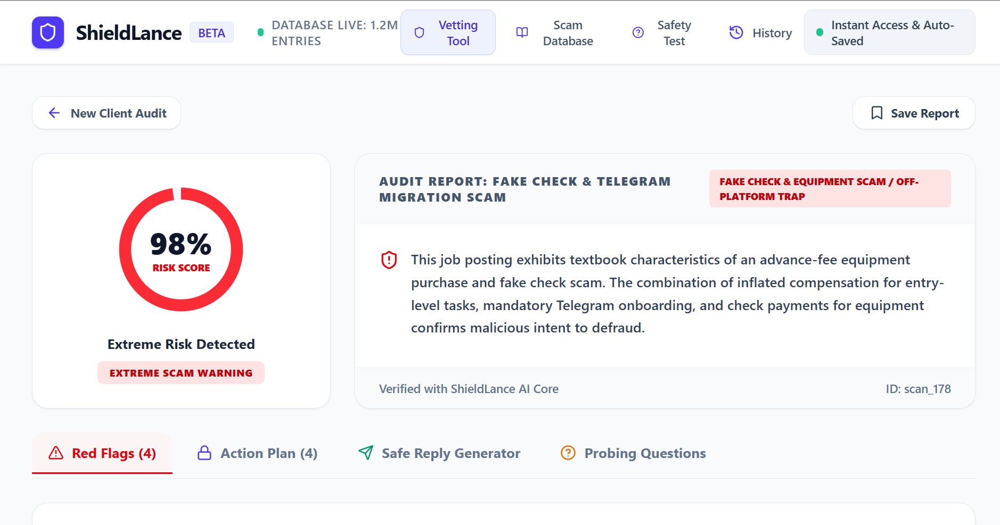
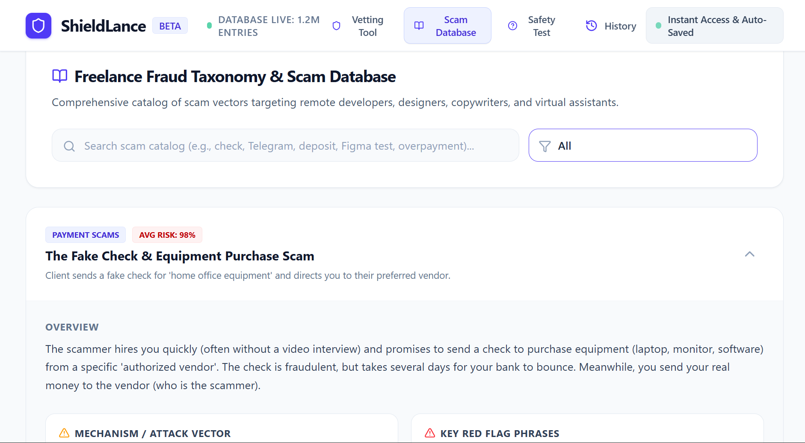
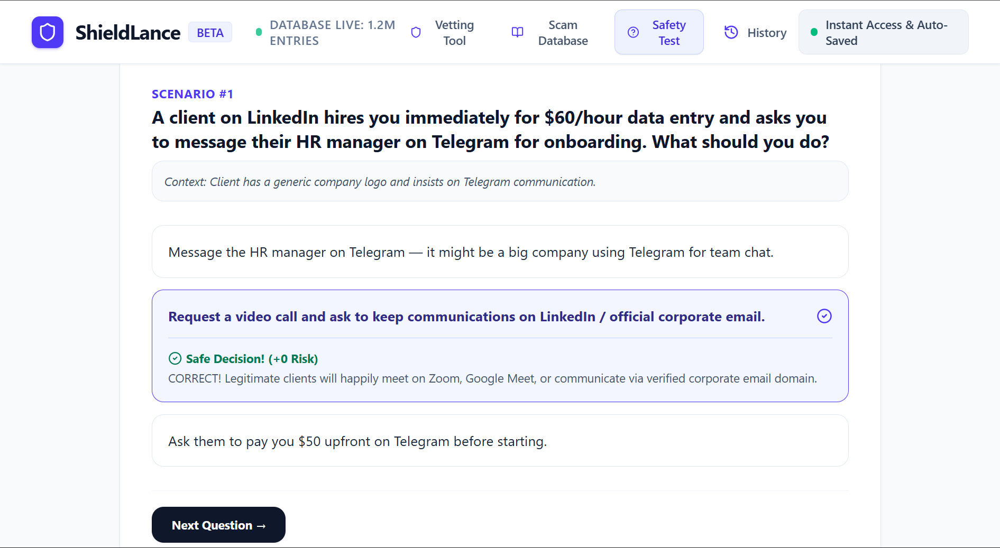

<div align="center">

# 🛡️ ShieldLance — Freelance Scam Checker

### AI-Powered Remote Work Fraud Detection, Contract Safety Specialist & Client Vetting Platform

[](https://shieldlance-0.netlify.app/)
[](https://ai.google.dev/)
[](https://react.dev/)
[](https://firebase.google.com/)

**Live Deployed Application:** [https://shieldlance-0.netlify.app/](https://shieldlance-0.netlify.app/)

---

</div>

## 📌 Executive Summary & Problem Solved

### The Problem
Freelancers, gig workers, and remote contractors lose millions of dollars and thousands of uncompensated work hours every year to increasingly sophisticated scams. Because freelancers operate without corporate HR departments, legal teams, or escrow safety nets, they are primary targets for:
* **Fake Check & Equipment Purchase Schemes:** Clients sending fraudulent checks or wire transfers asking freelancers to buy equipment from "approved vendors."
* **Off-Platform Migration Traps:** Clients forcing freelancers off protected platforms (Upwork, Fiverr) to Telegram or WhatsApp before a contract is established.
* **Unpaid Spec Work Exploitation:** Clients requesting completed 20-page "tests" or free custom designs under the guise of an evaluation.
* **Identity Theft & Phishing:** Unscreened clients demanding Social Security Numbers, passports, or banking logins before hiring.
* **Predatory Contracts:** Contracts hiding infinite revision clauses, non-competes, and strict liability terms.

### The Solution
**ShieldLance** is an end-to-end AI-powered fraud investigator and contract safety consultant designed specifically for freelancers. By leveraging **Gemini 3.6 Flash multimodal vision and structured analysis**, ShieldLance evaluates job postings, client email threads, PDF contracts, and messaging screenshots in seconds. It provides an objective 0–100 risk score, identifies granular red flags, drafts protective boundary-setting replies, and suggests probing questions to test client legitimacy.

---

## 🌐 Live Application URL

🔗 **Access the live deployed app:** [https://shieldlance-0.netlify.app/](https://shieldlance-0.netlify.app/)

---

## 🖼️ Application Screenshots

### 1. AI Scan & Risk Analysis Dashboard

*Multimodal analysis interface displaying objective 0–100 risk scoring, severity-categorized red flags, contract warnings, and AI-generated protective replies.*

### 2. Interactive Scam Pattern Library

*Comprehensive reference knowledge base breaking down major remote work fraud schemes with real-world examples, threat indicators, and mitigation checklists.*

### 3. Freelancer Safety & Defense Quiz

*Gamified 4-scenario evaluation tool testing freelancer fraud awareness with instant scoring, detailed explanations, and safety tips.*

---

## ✨ Comprehensive Feature Matrix

| Feature Module | Capabilities & Description |
| :--- | :--- |
| **🔍 Multi-Input Scanner** | Analyze raw job descriptions, email threads, contracts, or upload chat screenshots (OCR + Multimodal image analysis). |
| **📊 0–100 Risk Score Engine** | Objective score categorizing risk levels from *Safe / Legitimate (0–20)* to *Extreme Scam Warning (80–100)*. |
| **🚩 Categorized Red & Green Flags** | Highlights critical vulnerabilities across Payment Systems, Off-Platform Risks, Unrealistic Pay Rates, Identity Requests, and Unpaid Spec Demands, while recognizing legitimate indicators. |
| **💬 Safe Boundary Reply Generator** | Instantly generates professional, non-confrontational response templates for freelancers to enforce platform escrow rules, reject fake checks, or request identity verification. |
| **❓ Probing Questions Generator** | Provides 3–4 targeted questions freelancers can ask potential clients to test company legitimacy before signing contracts. |
| **📚 Scam Pattern Library** | In-depth breakdown of top fraud schemes (Equipment Purchase Checks, Telegram/WhatsApp Traps, Spec Work Exploitation, Overpayment Schemes, Phishing/Malware, and Predatory Contracts) with search and filter capabilities. |
| **🎓 Interactive Safety Quiz** | Gamified scenario-based quiz testing real-world fraud detection skills with instant feedback and score tracking. |
| **📜 History & Firebase Persistence** | Save past scan reports locally or sync them across devices via cloud storage using Firebase Firestore and Firebase Auth. |
| **⚡ Preset Test Scenarios** | One-click preset scenarios (Fake Check Scam, Upwork to Telegram Redirect, Unpaid 20-Page Test, Legitimate Tech Startup Offer) for rapid demonstration and testing. |

---

## 🤖 The AI Feature & System Prompt Architecture

### What the AI Feature Does
ShieldLance uses **Gemini 3.6 Flash** through a dedicated Express server API proxy (`/api/analyze`). The backend uses `@google/genai` to perform multimodal text and image reasoning against structured JSON schemas, ensuring 100% type-safe JSON output parsing without hallucinatory formatting issues.

### System Instructions & System Prompt Behind the AI
The AI investigator is governed by the following system prompt executed on every scan:

```text
You are an expert Freelance & Remote Work Scam Investigator and Legal/Contract Safety Specialist.
Your task is to analyze freelance job postings, client messages, payment requests, contract clauses, or platform URLs for potential scams, fraud patterns, and exploitation.

Analyze the input thoroughly looking for red flags such as:
1. Fake Check / Equipment Purchase scams (asking freelancer to deposit check & buy equipment from "approved vendors").
2. Off-platform migration traps (insisting on moving from Upwork/Fiverr to Telegram, WhatsApp, Google Chat immediately before hire).
3. Security deposit / Application fee / ID verification fee scams.
4. Unpaid test tasks or massive spec work demands (asking for free finished work).
5. Unrealistic hourly rate vs skills ratio (e.g., $60/hr for simple data entry / retyping PDF).
6. Crypto / Wire Transfer / Zelle / Cash App payment insistences without escrow protection.
7. Overpayment / Refund traps.
8. Identity theft (demanding SSN, passport, bank login upfront).
9. Suspicious phishing links, fake domain spoofs, or suspicious download packages (.exe, .scr files).
10. Unfair contract terms (e.g., perpetual unlimited revision without pay, non-competes, extreme indemnification).

You MUST evaluate objectively, assign an accurate Risk Score (0 = Completely Legitimate, 100 = Definitive Scam), provide categorized red flags and green flags, outline actionable recommended safety steps, and draft a polite, boundary-setting reply the freelancer can copy-paste to stay safe.
```

### JSON Schema Enforcement Details
The server enforces a structured schema requiring:
* `titleSnippet`: Short summary title.
* `riskScore`: Integer between 0 and 100.
* `riskLevel`: Risk classification label.
* `scamType`: Identified fraud pattern category.
* `summary`: 2–3 sentence executive verdict.
* `redFlags`: Array of `{ title, description, severity, category }`.
* `greenFlags`: Array of `{ title, description }`.
* `contractConcerns`: Array of risky clause descriptions.
* `recommendedActions`: Actionable steps.
* `suggestedReply`: Defensive, polite response message template.
* `safeQuestionsToAsk`: Array of probing questions.

---

## 🛠️ Tools, Services, & AI Models Used

* **Frontend Framework:** React 19, TypeScript, Vite
* **Styling & Icons:** Tailwind CSS v4, Lucide React (`lucide-react`)
* **Animations:** Motion (`motion/react`)
* **Backend API & Server:** Node.js, Express, `esbuild`, `tsx`
* **AI Model & SDK:** Google Gemini 3.6 Flash (`gemini-3.6-flash`), `@google/genai` SDK
* **Database & Auth:** Firebase v12 (Firestore Database & Firebase Authentication)
* **Hosting & Deployment:** Netlify ([Live App](https://shieldlance-0.netlify.app/)), Cloud Run container environment

---

## 🚀 How to Run the Project Locally

### Prerequisites
* **Node.js**: v18.0.0 or higher
* **npm**: v9.0.0 or higher
* **Gemini API Key**: Obtainable from [Google AI Studio](https://aistudio.google.com/)

### Step 1: Clone the Repository
```bash
git clone https://github.com/hirafaisalkhan2007-arch/freelance-scam-checker.git
cd freelance-scam-checker
```

### Step 2: Install Dependencies
```bash
npm install
```

### Step 3: Configure Environment Variables
Create a `.env` file in the project root directory:
```env
GEMINI_API_KEY=your_actual_gemini_api_key_here
```

### Step 4: Run Development Server
```bash
npm run dev
```
Open [http://localhost:3000](http://localhost:3000) in your browser to interact with the application.

### Step 5: Build & Run Production Server
```bash
# Compile client assets with Vite and bundle Express backend with esbuild
npm run build

# Start production server
npm start
```

---

<div align="center">

Made with ❤️ for freelancers worldwide | **ShieldLance Fraud Prevention**

</div>
